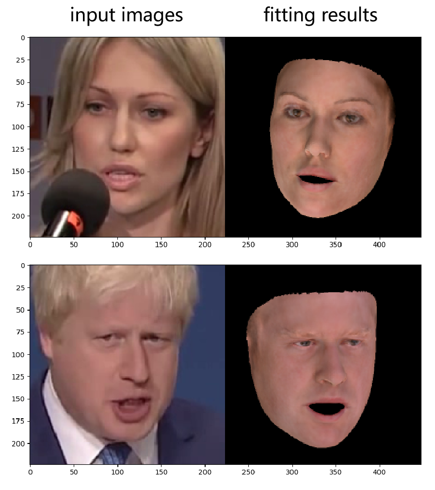
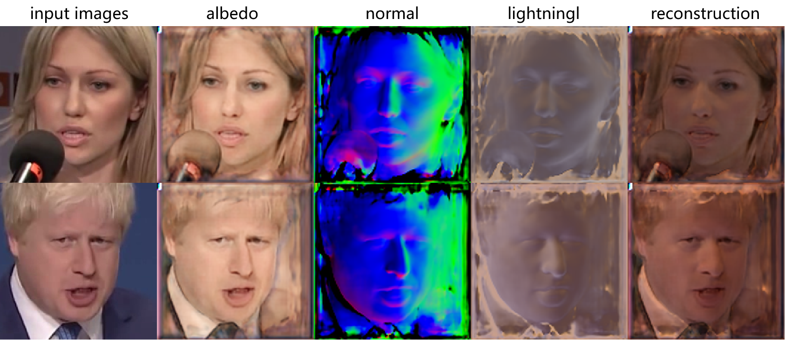

# video-face-3d

人脸工具包大杂烩，主要整合了近年来的SOTA的一些方法，包括视频人脸追踪，68关键点检测，三维人脸3DMM参数标注，shape-from-shading等


## 依赖

- pytorch  0.4.1以上
- tensorflow 1.0 以上
- neural_renderer_pytorch


## 安装

安装本代码前请先确保安装了pytorch,tensorflow以及neural_renderer_pytorch

- neural_renderer_pytorch安装说明

  - 如果你是Linux或者Mac用户，请直接`pip install neural_renderer_pytorch`

  - 如果你是Windows10用户，请参考[neural_renderer-win10](https://github.com/lstcutong/neural_renderer_pytorch-win10) 进行安装

下载本代码依赖的静态资源文件，解压到`/VideoFace3D/data`，下载链接[data.zip](https://pan.baidu.com/s/1B4hSHIbg2fsXk6e0zN2jsg)，密码 gdfz

推荐使用`develop`模式安装代码  `python setup.py develop`


## Examples

- 人脸关键点检测-单图像结果

  ```
  cd examples
  python example_landmarks_single_image.py
  ```


- 3DMM参数化模型拟合-单图像结果

  ```
  cd examples
  python example_fitting_single_image.py
  ```



- SFS- shape-from-shading 单图像结果

```
cd examples
python example_sfs_single_image.py
```




## TODO

- example视频
- api说明
